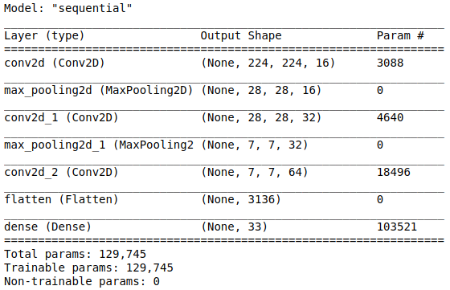
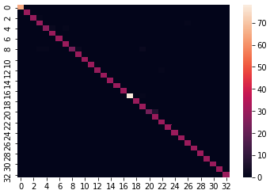

# Indian-Sign-Language-Translation-CNN

This was trained from my dataset: [Kaggle | Indian Sign Language Translation Letters n Digits](https://www.kaggle.com/kartik2112/indian-sign-language-translation-letters-n-digits)

This dataset has 10 digits and 23 out of the 26 letters of the alphabet.

A CNN was trained on this dataset and an accuracy of 98.14% was observed on unseen test dataset. 

## Model

## Results

## Dataset Samples

Few classes of the dataset had images similar to these:

